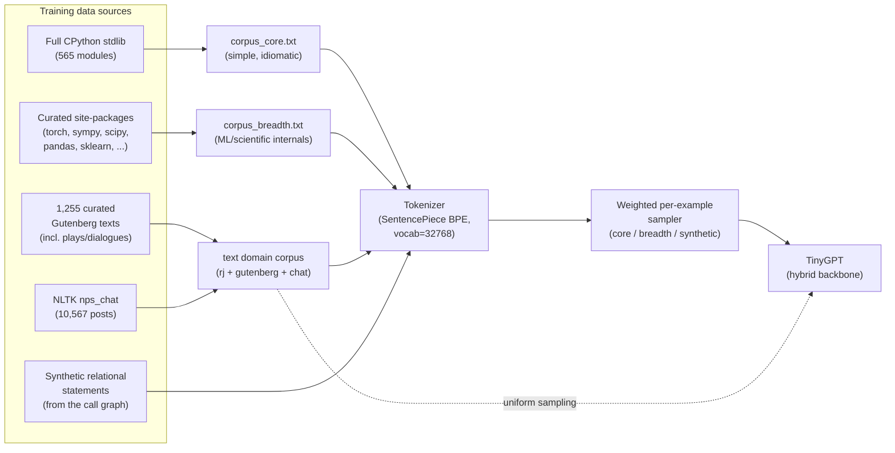
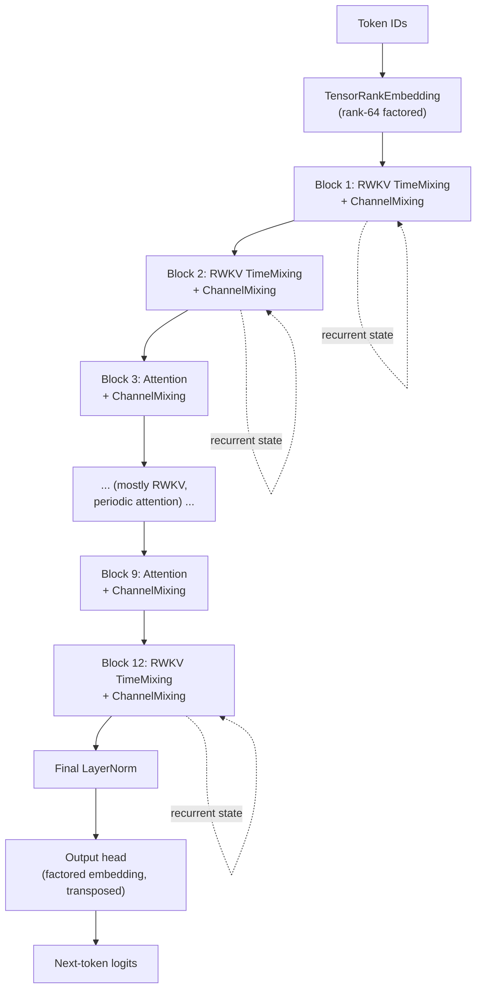
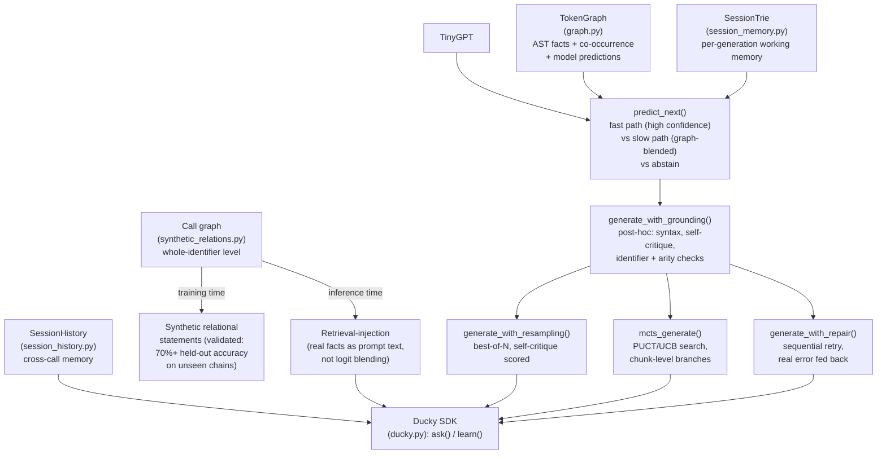

# uchi-experiments

Experiments for the uchi repository, held in isolation. The active result of
this project is **Ducky**: a small, hybrid RWKV+attention next-token
predictor with an external knowledge graph, calibrated abstention, and a
set of reasoning mechanisms layered on top -- all CPU-trainable, all
validated with real numbers, not assumed.

See [`tasks/core_principle.md`](tasks/core_principle.md) for the guiding
north star, [`tasks/ducky.md`](tasks/ducky.md) for Ducky's full architecture
record and evidence trail, and [`tasks/todo.md`](tasks/todo.md) for the
current compressed plan.

## Ducky as an agent: Python SDK + terminal UI

Ducky has zero instruction-tuning and zero native tool-calling -- it's a
raw next-token predictor, not a chat/function-calling model. The
`ducky_agent` package gives it an agent harness anyway, adapted to that
reality: tool calls are extracted from Ducky's free-text generation via a
fixed `Thought:`/`Action:` grammar (few-shot pattern-matching, not a
trained capability), and every write/exec action is gated behind a
permission check that asks a human by default, since Ducky is honestly
measured as unreliable (0/10 on `bench_ducky.py`, 0/5 on the harness's own
gradeable task set -- see `tasks/ducky.md`'s "Agent harness" section for
the full, honest numbers). This is real, tested infrastructure -- 56+
pytest tests, a scripted end-to-end integration suite, and headless TUI
tests all pass -- built and measured honestly ahead of the base model's
own capability catching up to use it well, the same discipline as every
other mechanism in this repo.

### Install

```bash
pip install -e . --break-system-packages   # or inside a venv, without the flag
```

This installs the `ducky-agent` console script and makes `ducky_agent`
(the SDK) and `ducky` (the underlying model class) both importable from
anywhere, not just `src/`.

### Python SDK

```python
from ducky_agent import DuckyAgent
from ducky_agent.permissions.types import PermissionMode

# model=None (the default) loads the real Ducky() checkpoint via
# ducky_agent.model_adapter.DuckyModel. permission_mode=PermissionMode.DEFAULT
# (the default) asks before any write_file/run_shell call; read_file/list_dir
# always auto-allow.
agent = DuckyAgent(permission_mode=PermissionMode.DEFAULT, max_turns=8)

# on_ask defaults to always "deny" -- the safe choice for a headless call
# with no human present. Supply your own callback to approve/deny per call,
# or use PermissionMode.YOLO to mostly skip asking at all.
result = agent.run(
    "List the files in this directory.",
    on_ask=lambda permission_request: "allow",
)

print(result.final_answer)   # str, or None if max_turns was hit first
print(result.hit_max_turns)  # bool
print(result.events)         # full ordered event log: ActionParsed, ParseErrorEvent,
                              # PermissionAsked, PermissionDenied, ToolExecuted, TurnComplete, MaxTurnsHit
```

`agent.run()` mirrors `Ducky.ask()`'s own "always returns, never raises"
contract: a parse failure, a denied permission, or hitting `max_turns` all
show up in `result.events`, never as an exception.

To script against a fixed, fake model (no torch/checkpoint cost -- useful
for testing your own tool-use prompts or CI):

```python
from ducky_agent.model_adapter import ScriptedModel

model = ScriptedModel(responses=[
    'Thought: check the directory.\nAction: list_dir(path=".")',
    "Done -- nothing unusual there.",
])
agent = DuckyAgent(model=model, permission_mode=PermissionMode.YOLO)
result = agent.run("look around")
```

The four available tools are `read_file(path)`, `list_dir(path=".")`,
`write_file(path, content)` (whole-file overwrite only, no patching), and
`run_shell(command, timeout=10.0)`.

### Terminal UI

```bash
ducky-agent                # real Ducky, PermissionMode.DEFAULT (asks before write/exec)
ducky-agent --yolo         # real Ducky, auto-allows everything except explicit deny rules
ducky-agent --fake-model   # a small ScriptedModel demo -- no checkpoint needed, good for a first look
ducky-agent --max-turns 12
```

A single screen: a header (permission mode + current turn), a scrolling
transcript, and an input line at the bottom. Type a task and press Enter.
When Ducky's generation contains an `Action:` for `write_file` or
`run_shell` under the default permission mode, a modal pops up showing the
exact pending tool call with three choices -- **Allow once**, **Always
allow this tool** (adds a session-scoped allow rule so that tool stops
asking for the rest of the session), or **Deny**. Nothing executes until
you decide. Generation runs in a background thread, so the UI stays
responsive while Ducky (or a real checkpoint's ~5-10s-per-call inference
time) is thinking.

## How Ducky is configured

### 1. Data and training



Two domains, two checkpoints: **code** (stdlib + curated libraries, weighted
so the small, simple-utility "core" pool isn't drowned out by the much
larger "breadth" pool) and **text** (Shakespeare + Gutenberg + real chat/
dialogue). Same architecture, same tokenizer, independently trained.

### 2. The hybrid backbone (TinyGPT)



Mostly linear-recurrent (RWKV time-mixing: O(1) memory/token, unlimited
context in principle) with attention at a couple of fixed layers for
in-window quality -- mirrors uchi's own SSM-plus-periodic-attention design,
at much smaller scale. Validated repeatedly (6/6 seeds, both domains) to
beat both pure attention and pure RWKV on held-out loss.

**Known limitation, not hidden:** the RWKV state's unlimited-context
property is structurally real (constant memory, linear time, verified
directly) but not exploited by training -- five independent rounds
(varying data scale, step budget, architecture, training regime, and the
loss function itself) all found zero measurable retention across chunk
boundaries. Likely a vanishing-gradient limit at this parameter count, not
a training-recipe problem. See `tasks/ducky.md` for the full evidence chain.

### 3. Grounding, memory, and reasoning (external to the neural net)



Three distinct notions of "memory," deliberately kept separate: the
**graph** (corpus-level, static, consulted via confidence blending), the
**call graph** (whole-identifier, used both to teach composition at
training time and to inject real facts at inference time), and **session
memory/history** (per-generation and per-instance bookkeeping, not
learned). None of these add a second model or a vote -- every signal is
cheap and checkable against something real (parse validity, a real symbol,
a real n-gram, this checkpoint's own calibrated confidence).

## Honest, current status

- Real benchmark result before this round's data expansion: **0/10** on a
  held-out coding task set, across every mechanism above -- the reasoning
  scaffolding was correctly built but had nothing to work with, because the
  base model abstained after 1-2 tokens on every prompt.
- Root cause diagnosed as a Chinchilla data deficit (10M params, ~387K
  training tokens -- ~570x under the standard ~20-tokens/param ratio), not
  an architecture problem.
- Corpus since expanded ~30-100x per domain (data sourcing scripts:
  `extract_code_corpus.py`, `extract_gutenberg_corpus.py`,
  `extract_chat_corpus.py`), vocabulary regrown 8192 -> 32768 to match, and
  a full retrain is in progress. See `tasks/ducky.md` for the complete,
  continuously-updated evidence trail -- including what didn't work, not
  just what did.
