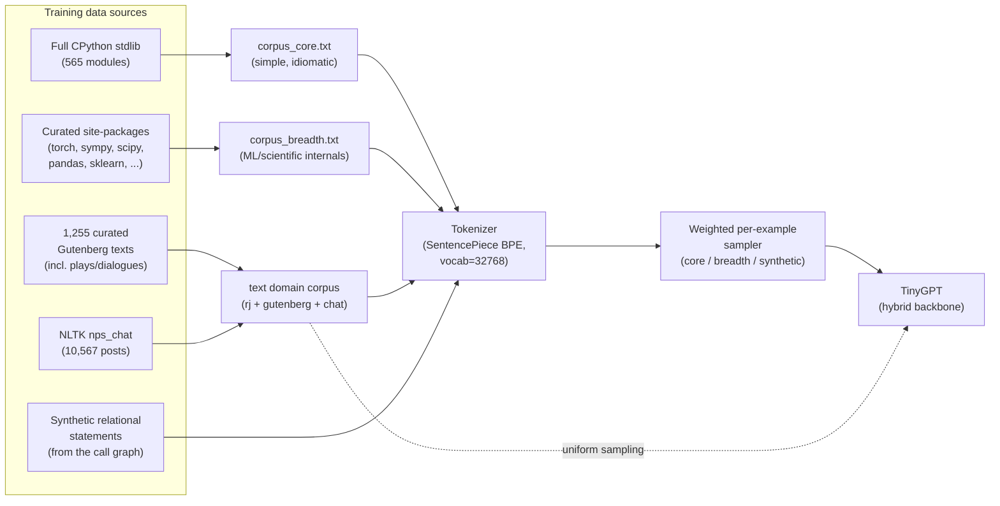
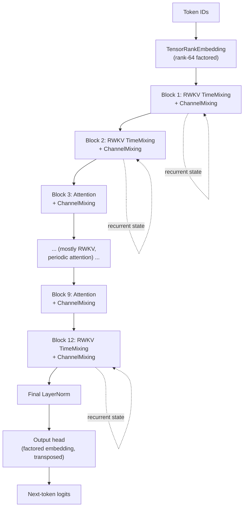
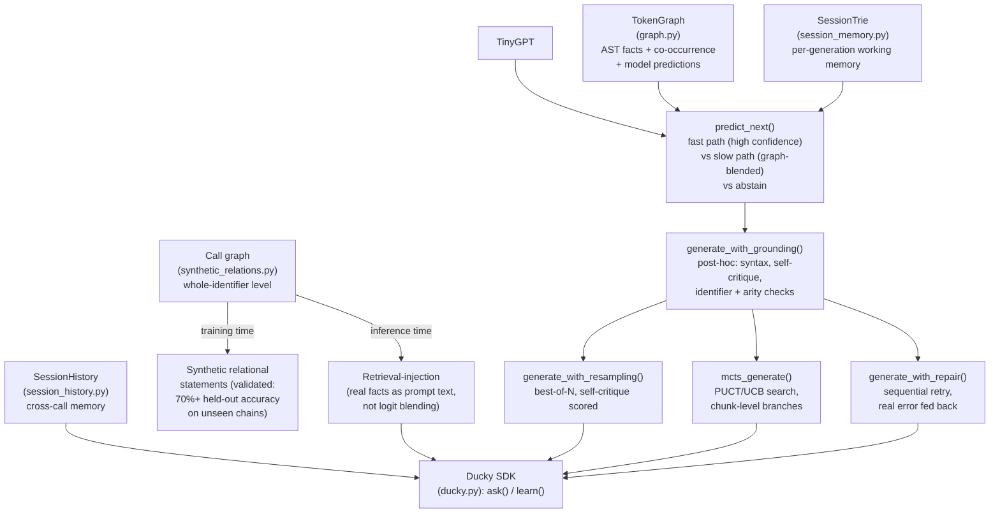

# uchi-experiments

Experiments for the uchi repository, held in isolation. The active result of
this project is **Ducky**: a small, hybrid RWKV+attention next-token
predictor with an external knowledge graph, calibrated abstention, and a
set of reasoning mechanisms layered on top -- all CPU-trainable, all
validated with real numbers, not assumed.

See [`tasks/core_principle.md`](tasks/core_principle.md) for the guiding
north star, [`tasks/ducky.md`](tasks/ducky.md) for Ducky's full architecture
record and evidence trail, and [`tasks/todo.md`](tasks/todo.md) for the
current compressed plan.

## How Ducky is configured

### 1. Data and training

Two domains, two checkpoints: **code** (stdlib + curated libraries, weighted
so the small, simple-utility "core" pool isn't drowned out by the much
larger "breadth" pool) and **text** (Shakespeare + Gutenberg + real chat/
dialogue). Same architecture, same tokenizer, independently trained.

### 2. The hybrid backbone (TinyGPT)

Mostly linear-recurrent (RWKV time-mixing: O(1) memory/token, unlimited
context in principle) with attention at a couple of fixed layers for
in-window quality -- mirrors uchi's own SSM-plus-periodic-attention design,
at much smaller scale. Validated repeatedly (6/6 seeds, both domains) to
beat both pure attention and pure RWKV on held-out loss.

**Known limitation, not hidden:** the RWKV state's unlimited-context
property is structurally real (constant memory, linear time, verified
directly) but not exploited by training -- five independent rounds
(varying data scale, step budget, architecture, training regime, and the
loss function itself) all found zero measurable retention across chunk
boundaries. Likely a vanishing-gradient limit at this parameter count, not
a training-recipe problem. See `tasks/ducky.md` for the full evidence chain.

### 3. Grounding, memory, and reasoning (external to the neural net)

Three distinct notions of "memory," deliberately kept separate: the
**graph** (corpus-level, static, consulted via confidence blending), the
**call graph** (whole-identifier, used both to teach composition at
training time and to inject real facts at inference time), and **session
memory/history** (per-generation and per-instance bookkeeping, not
learned). None of these add a second model or a vote -- every signal is
cheap and checkable against something real (parse validity, a real symbol,
a real n-gram, this checkpoint's own calibrated confidence).

## Honest, current status

- Real benchmark result before this round's data expansion: **0/10** on a
  held-out coding task set, across every mechanism above -- the reasoning
  scaffolding was correctly built but had nothing to work with, because the
  base model abstained after 1-2 tokens on every prompt.
- Root cause diagnosed as a Chinchilla data deficit (10M params, ~387K
  training tokens -- ~570x under the standard ~20-tokens/param ratio), not
  an architecture problem.
- Corpus since expanded ~30-100x per domain (data sourcing scripts:
  `extract_code_corpus.py`, `extract_gutenberg_corpus.py`,
  `extract_chat_corpus.py`), vocabulary regrown 8192 -> 32768 to match, and
  a full retrain is in progress. See `tasks/ducky.md` for the complete,
  continuously-updated evidence trail -- including what didn't work, not
  just what did.
